# Diagramas

Proyecto Gastos. Trabajo Final Integrador, TUP UTN.

Los diagramas están escritos en Mermaid. El
DER completo está aparte en [der/](der/).

| # | Diagrama | Qué muestra |
|---|---|---|
| 1 | [Casos de uso](#1-diagrama-de-casos-de-uso) | Actores, casos de uso y sus relaciones `«include»` y `«extend»` |
| 2 | [Componentes](#2-diagrama-de-componentes) | Piezas del cliente, la API y la base, y las interfaces por las que se comunican |
| 3 | [Arquitectura](#3-diagrama-de-arquitectura) | Niveles de la solución, capas del backend y barreras de validación |
| 4 | [Secuencia](#4-diagramas-de-secuencia) | Registro, petición autenticada, alta de gasto, cambio de hogar, captura rápida y aislamiento |
| 5 | [Actividad](#5-diagramas-de-actividad) | Inicio de sesión, alta de gasto con el motor de reglas, creación de regla y restablecimiento de contraseña |
| 6 | [Despliegue](#6-diagrama-de-despliegue) | Nodos de producción y del entorno de desarrollo, con sus artefactos y protocolos |
| 7 | [Complementarios](#7-diagramas-complementarios) | Estados de un gasto, entidad-relación resumido y flujo de trabajo del equipo |

Los casos `CU-xx` remiten a [casos-de-uso.md](casos-de-uso.md), y los identificadores `RF`, `RNF`
y `RN`, a [requerimientos.md](requerimientos.md) y [reglas-de-negocio.md](reglas-de-negocio.md).

---

## 1. Diagrama de casos de uso

Mermaid no tiene un tipo de diagrama de casos de uso, así que se representa con su notación de
flujo y las convenciones de UML. Los actores son círculos. Los casos de uso son óvalos dentro del
límite del sistema. Las flechas punteadas son relaciones entre casos.

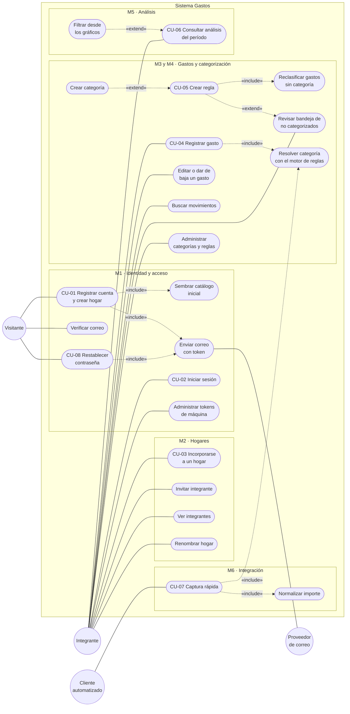
```mermaid
flowchart LR
    V(("Visitante"))
    I(("Integrante"))
    C(("Cliente<br/>automatizado"))

    subgraph SYS["Sistema Gastos"]
        subgraph M1["M1 · Identidad y acceso"]
            CU01(["CU-01 Registrar cuenta<br/>y crear hogar"])
            VER(["Verificar correo"])
            CU08(["CU-08 Restablecer<br/>contraseña"])
            CU02(["CU-02 Iniciar sesión"])
            TOK(["Administrar tokens<br/>de máquina"])
            MAIL(["Enviar correo<br/>con token"])
            SEED(["Sembrar catálogo<br/>inicial"])
        end

        subgraph M2["M2 · Hogares"]
            INV(["Invitar integrante"])
            CU03(["CU-03 Incorporarse<br/>a un hogar"])
            MEM(["Ver integrantes"])
            REN(["Renombrar hogar"])
        end

        subgraph M34["M3 y M4 · Gastos y categorización"]
            CU04(["CU-04 Registrar gasto"])
            EDIT(["Editar o dar de<br/>baja un gasto"])
            LIST(["Buscar movimientos"])
            BAND(["Revisar bandeja de<br/>no categorizados"])
            CU05(["CU-05 Crear regla"])
            RECL(["Reclasificar gastos<br/>sin categoría"])
            NEWCAT(["Crear categoría"])
            CAT(["Administrar<br/>categorías y reglas"])
            RES(["Resolver categoría<br/>con el motor de reglas"])
        end

        subgraph M5["M5 · Análisis"]
            CU06(["CU-06 Consultar análisis<br/>del período"])
            FILT(["Filtrar desde<br/>los gráficos"])
        end

        subgraph M6["M6 · Integración"]
            CU07(["CU-07 Captura rápida"])
            NORM(["Normalizar importe"])
        end
    end

    E(("Proveedor<br/>de correo"))

    V --- CU01
    V --- VER
    V --- CU08

    I --- CU02
    I --- CU03
    I --- INV
    I --- MEM
    I --- REN
    I --- CU04
    I --- EDIT
    I --- LIST
    I --- BAND
    I --- CAT
    I --- CU06
    I --- TOK

    C --- CU07

    CU01 -.->|«include»| SEED
    CU01 -.->|«include»| MAIL
    CU08 -.->|«include»| MAIL
    MAIL --- E

    CU04 -.->|«include»| RES
    CU07 -.->|«include»| RES
    CU07 -.->|«include»| NORM
    CU05 -.->|«include»| RECL
    CU05 -.->|«extend»| BAND
    NEWCAT -.->|«extend»| CU05
    FILT -.->|«extend»| CU06
```

**Cómo se lee.**

- `«include»` apunta del caso base al caso incluido, que se ejecuta siempre. Registrar un gasto,
  por la interfaz o por la captura rápida, siempre pasa por el motor de reglas.
- `«extend»` apunta del caso que extiende al caso base, y solo ocurre bajo una condición. Crear una
  categoría extiende CU-05 cuando la categoría destino no existe (flujo alternativo 3a). CU-05
  extiende la revisión de la bandeja, que es desde donde se llega habitualmente.
- El proveedor de correo es un actor secundario. No inicia ningún caso, pero participa en los que
  envían un token.
- CU-03 lo inicia un integrante con sesión y no un visitante. Por RN-11, todo usuario ya tiene un
  hogar desde el registro, así que incorporarse a otro es cambiarse de hogar (RN-18).

---

## 2. Diagrama de componentes

Componentes de las tres piezas desplegables y las interfaces que usan entre sí. Dentro de la API,
cada módulo de negocio agrupa su controlador (`web`) y su servicio (`service`).

Los componentes con borde punteado todavía no están incorporados a `main` al 04/10/2026. El estado
de cada uno está en [modulos.md](modulos.md).

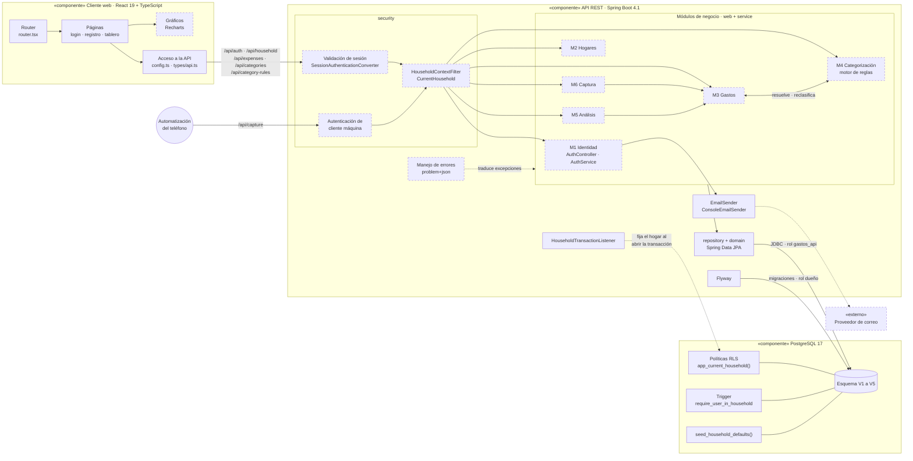
```mermaid
flowchart LR
    AUTO(("Automatización<br/>del teléfono"))

    subgraph WEB["«componente» Cliente web · React 19 + TypeScript"]
        direction TB
        ROUTER["Router<br/>router.tsx"]
        PAGES["Páginas<br/>login · registro · tablero"]
        CHARTS["Gráficos<br/>Recharts"]
        APIC["Acceso a la API<br/>config.ts · types/api.ts"]
        ROUTER --> PAGES
        PAGES --> CHARTS
        PAGES --> APIC
    end

    subgraph API["«componente» API REST · Spring Boot 4.1"]
        direction TB

        subgraph SEC["security"]
            JWT["Validación de sesión<br/>SessionAuthenticationConverter"]
            MTA["Autenticación de<br/>cliente máquina"]
            HCF["HouseholdContextFilter<br/>CurrentHousehold"]
        end

        subgraph MOD["Módulos de negocio · web + service"]
            AUTH["M1 Identidad<br/>AuthController · AuthService"]
            HH["M2 Hogares"]
            EXP["M3 Gastos"]
            CATS["M4 Categorización<br/>motor de reglas"]
            ANA["M5 Análisis"]
            CAP["M6 Captura"]
        end

        ERR["Manejo de errores<br/>problem+json"]
        MAILC["EmailSender<br/>ConsoleEmailSender"]
        TXL["HouseholdTransactionListener"]
        REPO["repository + domain<br/>Spring Data JPA"]
        FLY["Flyway"]
    end

    subgraph DB["«componente» PostgreSQL 17"]
        direction TB
        SCHEMA[("Esquema V1 a V5")]
        RLS["Políticas RLS<br/>app_current_household()"]
        TRG["Trigger<br/>require_user_in_household"]
        SEEDF["seed_household_defaults()"]
    end

    MAILX["«externo»<br/>Proveedor de correo"]

    APIC -->|"/api/auth · /api/household<br/>/api/expenses · /api/categories<br/>/api/category-rules"| JWT
    AUTO -->|"/api/capture"| MTA
    JWT --> HCF
    MTA --> HCF
    HCF --> AUTH & HH & EXP & CATS & ANA & CAP

    EXP <-->|"resuelve · reclasifica"| CATS
    CAP --> EXP
    ANA --> EXP
    AUTH --> MAILC
    MAILC -.-> MAILX
    ERR -.->|"traduce excepciones"| MOD

    MOD --> REPO
    TXL -.->|"fija el hogar al<br/>abrir la transacción"| RLS
    REPO -->|"JDBC · rol gastos_api"| SCHEMA
    FLY -->|"migraciones · rol dueño"| SCHEMA
    RLS --- SCHEMA
    TRG --- SCHEMA
    SEEDF --- SCHEMA

    classDef previsto stroke-dasharray: 5 5
    class JWT,MTA,HCF,AUTH,HH,EXP,CATS,ANA,CAP,ERR,CHARTS,MAILX previsto
```

| Componente | Responsabilidad |
|---|---|
| Acceso a la API | URL base de la API (`VITE_API_URL`) y tipos de los contratos, espejo de los DTOs del backend. |
| Validación de sesión | Valida firma y vencimiento del token de sesión y lee de la base el hogar actual del usuario (RN-18). |
| Autenticación de cliente máquina | Busca el token por su hash, verifica que no esté revocado y que su hogar sea el actual de su dueño. Solo habilita `/api/capture`. |
| `HouseholdContextFilter` | Pasa el hogar del usuario autenticado a `CurrentHousehold` y lo limpia al terminar la petición. |
| `HouseholdTransactionListener` | Al comenzar cada transacción, fija el hogar en Postgres con alcance de transacción. |
| Módulos M1 a M6 | Reglas de negocio y límites transaccionales de cada módulo. El detalle está en [modulos.md](modulos.md). |
| `EmailSender` | Interfaz de envío de correos. La implementación se elige con `EMAIL_SENDER`. Hoy existe solo la de consola, para desarrollo. |
| Políticas RLS y trigger | Aislamiento entre hogares y última barrera contra escrituras a nombre de quien no integra el hogar. |

---

## 3. Diagrama de arquitectura

### 3.1 Vista general

Arquitectura cliente-servidor en tres niveles, con tres piezas desplegables independientes que se
comunican por HTTP. El cliente web no contiene lógica de negocio. Toda regla, validación y decisión
de autorización vive en la API, y el motor de base de datos hace cumplir el aislamiento.

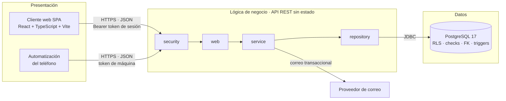
```mermaid
flowchart LR
    subgraph PRES["Presentación"]
        SPA["Cliente web SPA<br/>React + TypeScript + Vite"]
        AUT["Automatización<br/>del teléfono"]
    end

    subgraph LOG["Lógica de negocio · API REST sin estado"]
        direction TB
        L_SEC["security"]
        L_WEB["web"]
        L_SVC["service"]
        L_REP["repository"]
        L_SEC --> L_WEB --> L_SVC --> L_REP
    end

    subgraph DAT["Datos"]
        PG[("PostgreSQL 17<br/>RLS · checks · FK · triggers")]
    end

    MAILP["Proveedor de correo"]

    SPA -->|"HTTPS · JSON<br/>Bearer token de sesión"| L_SEC
    AUT -->|"HTTPS · JSON<br/>token de máquina"| L_SEC
    L_REP -->|"JDBC"| PG
    L_SVC -->|"correo transaccional"| MAILP
```

Decisiones que definen la arquitectura:

- **API sin estado.** El token de sesión es un JWT firmado que el servidor no guarda. Cualquier
  instancia de la API puede atender cualquier petición, sin sesión compartida.
- **El hogar se resuelve en el servidor.** El token solo identifica al usuario. El hogar se lee de
  `users.household_id` en cada petición, porque puede haber cambiado desde que se emitió el token
  (RN-18). Ninguna ruta lleva el identificador del hogar.
- **El aislamiento vive en el motor.** Las políticas RLS alcanzan a toda consulta sobre gastos,
  categorías y reglas, y fallan cerradas: sin hogar en contexto devuelven cero filas (RNF-01,
  RNF-03).
- **El esquema pertenece a las migraciones.** Flyway lo crea y lo modifica. Hibernate solo lo
  valida al arrancar (RN-15).

### 3.2 Capas del backend

Cada capa conoce únicamente a la inmediatamente inferior (RNF-22).

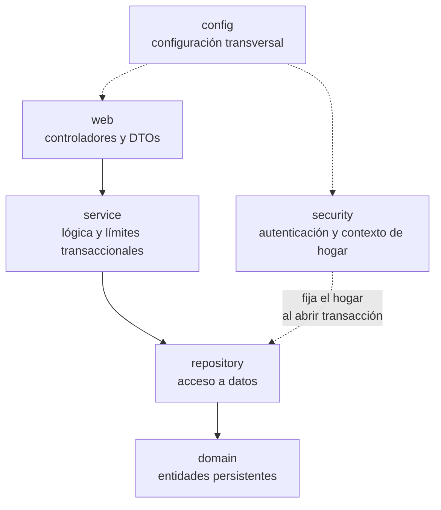
```mermaid
flowchart TB
    WEB["web<br/>controladores y DTOs"]
    SVC["service<br/>lógica y límites transaccionales"]
    REP["repository<br/>acceso a datos"]
    DOM["domain<br/>entidades persistentes"]
    SEC["security<br/>autenticación y contexto de hogar"]
    CFG["config<br/>configuración transversal"]

    WEB --> SVC
    SVC --> REP
    REP --> DOM
    SEC -.->|"fija el hogar<br/>al abrir transacción"| REP
    CFG -.-> WEB
    CFG -.-> SEC
```

Las entidades persistentes y los objetos de transferencia son tipos distintos. El modelo interno
nunca se expone en la API (RNF-23).

### 3.3 Barreras de validación

Una escritura atraviesa cuatro barreras. Las dos primeras dan mensajes útiles al usuario. Las dos
últimas están en el motor, así que no dependen de que el código de la aplicación sea correcto.

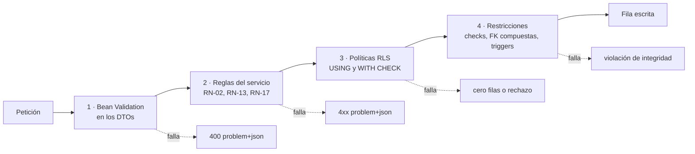
```mermaid
flowchart LR
    REQ["Petición"] --> B1["1 · Bean Validation<br/>en los DTOs"]
    B1 --> B2["2 · Reglas del servicio<br/>RN-02, RN-13, RN-17"]
    B2 --> B3["3 · Políticas RLS<br/>USING y WITH CHECK"]
    B3 --> B4["4 · Restricciones<br/>checks, FK compuestas, triggers"]
    B4 --> OK["Fila escrita"]

    B1 -.->|falla| R400["400 problem+json"]
    B2 -.->|falla| R4XX["4xx problem+json"]
    B3 -.->|falla| R404["cero filas o rechazo"]
    B4 -.->|falla| RERR["violación de integridad"]
```

---

## 4. Diagramas de secuencia

### 4.1 Registro de cuenta y creación del hogar (CU-01)

El alta del usuario, el hogar y su catálogo es una sola transacción (RN-11). El token de
verificación y el envío del correo quedan afuera: si el correo falla, la cuenta ya existe y el
envío se puede reintentar (RNF-21).

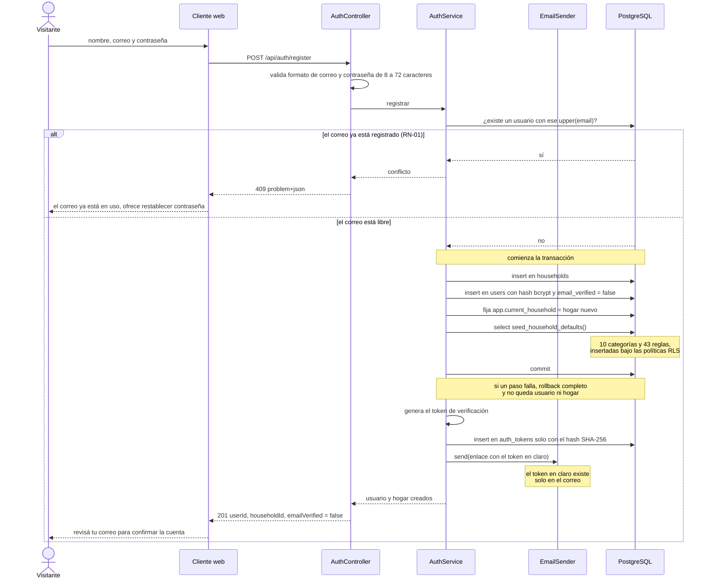
```mermaid
sequenceDiagram
    actor U as Visitante
    participant W as Cliente web
    participant C as AuthController
    participant S as AuthService
    participant M as EmailSender
    participant DB as PostgreSQL

    U->>W: nombre, correo y contraseña
    W->>C: POST /api/auth/register
    C->>C: valida formato de correo y contraseña de 8 a 72 caracteres
    C->>S: registrar
    S->>DB: ¿existe un usuario con ese upper(email)?

    alt el correo ya está registrado (RN-01)
        DB-->>S: sí
        S-->>C: conflicto
        C-->>W: 409 problem+json
        W-->>U: el correo ya está en uso, ofrece restablecer contraseña
    else el correo está libre
        DB-->>S: no
        Note over S,DB: comienza la transacción
        S->>DB: insert en households
        S->>DB: insert en users con hash bcrypt y email_verified = false
        S->>DB: fija app.current_household = hogar nuevo
        S->>DB: select seed_household_defaults()
        Note over DB: 10 categorías y 43 reglas,<br/>insertadas bajo las políticas RLS
        S->>DB: commit
        Note over S,DB: si un paso falla, rollback completo<br/>y no queda usuario ni hogar

        S->>S: genera el token de verificación
        S->>DB: insert en auth_tokens solo con el hash SHA-256
        S->>M: send(enlace con el token en claro)
        Note over M: el token en claro existe<br/>solo en el correo
        S-->>C: usuario y hogar creados
        C-->>W: 201 userId, householdId, emailVerified = false
        W-->>U: revisá tu correo para confirmar la cuenta
    end
```

### 4.2 Resolución del hogar en una petición autenticada

Lo que ocurre antes de que cualquier controlador atienda una petición con sesión. El hogar no sale
del token sino de la base, y se limpia al terminar para que el hilo no lo arrastre a la petición
siguiente.

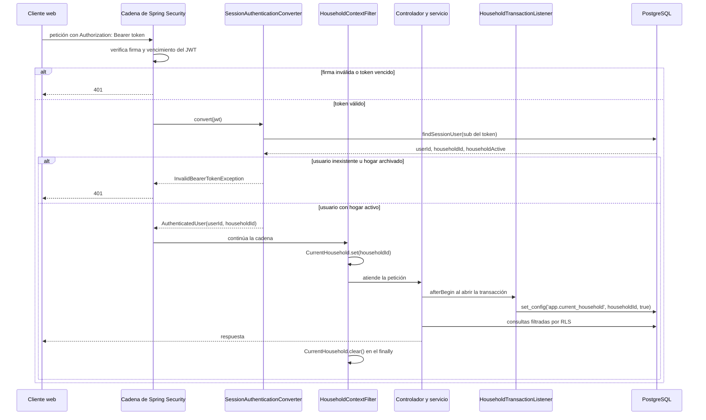
```mermaid
sequenceDiagram
    participant W as Cliente web
    participant F as Cadena de Spring Security
    participant SC as SessionAuthenticationConverter
    participant HF as HouseholdContextFilter
    participant CT as Controlador y servicio
    participant L as HouseholdTransactionListener
    participant DB as PostgreSQL

    W->>F: petición con Authorization: Bearer token
    F->>F: verifica firma y vencimiento del JWT

    alt firma inválida o token vencido
        F-->>W: 401
    else token válido
        F->>SC: convert(jwt)
        SC->>DB: findSessionUser(sub del token)
        DB-->>SC: userId, householdId, householdActive

        alt usuario inexistente u hogar archivado
            SC-->>F: InvalidBearerTokenException
            F-->>W: 401
        else usuario con hogar activo
            SC-->>F: AuthenticatedUser(userId, householdId)
            F->>HF: continúa la cadena
            HF->>HF: CurrentHousehold.set(householdId)
            HF->>CT: atiende la petición
            CT->>L: afterBegin al abrir la transacción
            L->>DB: set_config('app.current_household', householdId, true)
            CT->>DB: consultas filtradas por RLS
            CT-->>W: respuesta
            HF->>HF: CurrentHousehold.clear() en el finally
        end
    end
```

### 4.3 Registro de un gasto con categorización automática (CU-04)

Muestra dónde se fija el contexto de aislamiento y en qué momento actúa el motor de reglas. La
autenticación y la resolución del hogar son las de 4.2.

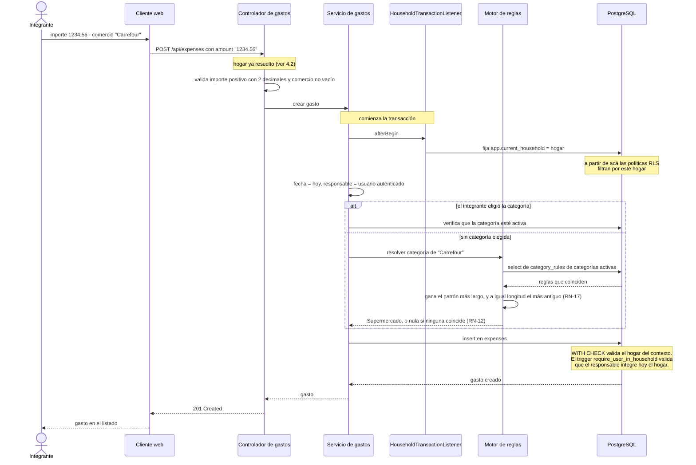
```mermaid
sequenceDiagram
    actor U as Integrante
    participant W as Cliente web
    participant C as Controlador de gastos
    participant S as Servicio de gastos
    participant L as HouseholdTransactionListener
    participant M as Motor de reglas
    participant DB as PostgreSQL

    U->>W: importe 1234,56 · comercio "Carrefour"
    W->>C: POST /api/expenses con amount "1234.56"
    Note over C: hogar ya resuelto (ver 4.2)
    C->>C: valida importe positivo con 2 decimales y comercio no vacío
    C->>S: crear gasto

    Note over S,L: comienza la transacción
    S->>L: afterBegin
    L->>DB: fija app.current_household = hogar
    Note over DB: a partir de acá las políticas RLS<br/>filtran por este hogar

    S->>S: fecha = hoy, responsable = usuario autenticado

    alt el integrante eligió la categoría
        S->>DB: verifica que la categoría esté activa
    else sin categoría elegida
        S->>M: resolver categoría de "Carrefour"
        M->>DB: select de category_rules de categorías activas
        DB-->>M: reglas que coinciden
        M->>M: gana el patrón más largo, y a igual longitud el más antiguo (RN-17)
        M-->>S: Supermercado, o nula si ninguna coincide (RN-12)
    end

    S->>DB: insert en expenses
    Note over DB: WITH CHECK valida el hogar del contexto.<br/>El trigger require_user_in_household valida<br/>que el responsable integre hoy el hogar.
    DB-->>S: gasto creado
    S-->>C: gasto
    C-->>W: 201 Created
    W-->>U: gasto en el listado
```

**Flujo alternativo:** si el motor no encuentra coincidencia, el gasto se registra con categoría
nula y aparece en la bandeja de no categorizados (RN-12).

### 4.4 Incorporarse a otro hogar (CU-03)

Dos llamadas. La vista previa no cambia nada y alimenta la advertencia que exige RN-18. El canje
repite todas las validaciones y aplica el cambio en una sola transacción.

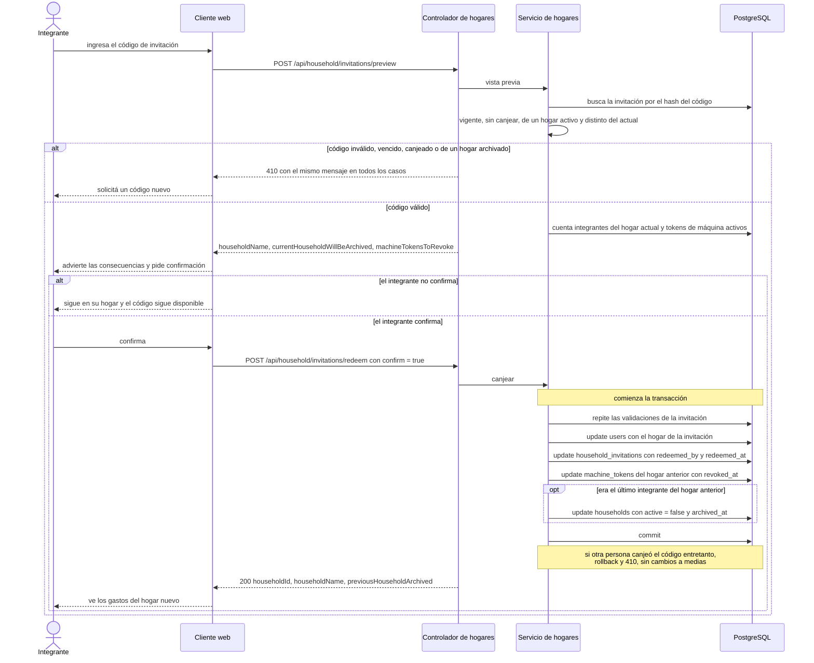
```mermaid
sequenceDiagram
    actor U as Integrante
    participant W as Cliente web
    participant C as Controlador de hogares
    participant S as Servicio de hogares
    participant DB as PostgreSQL

    U->>W: ingresa el código de invitación
    W->>C: POST /api/household/invitations/preview
    C->>S: vista previa
    S->>DB: busca la invitación por el hash del código
    S->>S: vigente, sin canjear, de un hogar activo y distinto del actual

    alt código inválido, vencido, canjeado o de un hogar archivado
        C-->>W: 410 con el mismo mensaje en todos los casos
        W-->>U: solicitá un código nuevo
    else código válido
        S->>DB: cuenta integrantes del hogar actual y tokens de máquina activos
        C-->>W: householdName, currentHouseholdWillBeArchived, machineTokensToRevoke
        W-->>U: advierte las consecuencias y pide confirmación

        alt el integrante no confirma
            W-->>U: sigue en su hogar y el código sigue disponible
        else el integrante confirma
            U->>W: confirma
            W->>C: POST /api/household/invitations/redeem con confirm = true
            C->>S: canjear
            Note over S,DB: comienza la transacción
            S->>DB: repite las validaciones de la invitación
            S->>DB: update users con el hogar de la invitación
            S->>DB: update household_invitations con redeemed_by y redeemed_at
            S->>DB: update machine_tokens del hogar anterior con revoked_at
            opt era el último integrante del hogar anterior
                S->>DB: update households con active = false y archived_at
            end
            S->>DB: commit
            Note over S,DB: si otra persona canjeó el código entretanto,<br/>rollback y 410, sin cambios a medias
            C-->>W: 200 householdId, householdName, previousHouseholdArchived
            W-->>U: ve los gastos del hogar nuevo
        end
    end
```

Los gastos que el integrante cargó quedan en el hogar anterior, a su nombre. Como el hogar de cada
petición se lee de la base (4.2), un token de sesión emitido antes del cambio ya no alcanza el
hogar anterior.

### 4.5 Captura rápida desde un cliente automatizado (CU-07)

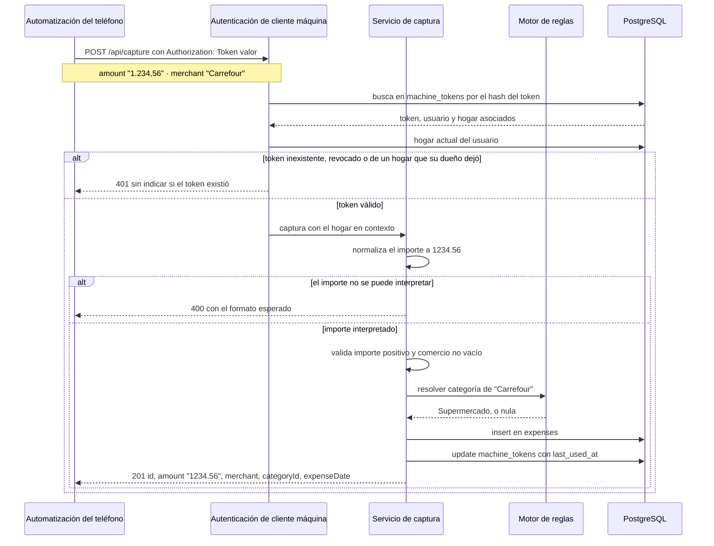
```mermaid
sequenceDiagram
    participant A as Automatización del teléfono
    participant F as Autenticación de cliente máquina
    participant S as Servicio de captura
    participant M as Motor de reglas
    participant DB as PostgreSQL

    A->>F: POST /api/capture con Authorization: Token valor
    Note over A,F: amount "1.234,56" · merchant "Carrefour"
    F->>DB: busca en machine_tokens por el hash del token
    DB-->>F: token, usuario y hogar asociados
    F->>DB: hogar actual del usuario

    alt token inexistente, revocado o de un hogar que su dueño dejó
        F-->>A: 401 sin indicar si el token existió
    else token válido
        F->>S: captura con el hogar en contexto
        S->>S: normaliza el importe a 1234.56

        alt el importe no se puede interpretar
            S-->>A: 400 con el formato esperado
        else importe interpretado
            S->>S: valida importe positivo y comercio no vacío
            S->>M: resolver categoría de "Carrefour"
            M-->>S: Supermercado, o nula
            S->>DB: insert en expenses
            S->>DB: update machine_tokens con last_used_at
            S-->>A: 201 id, amount "1234.56", merchant, categoryId, expenseDate
        end
    end
```

El token solo habilita este punto de entrada. Usado contra cualquier otra ruta de la API, se
rechaza (HU-17).

### 4.6 Intento de acceso a datos de otro hogar

La propiedad de seguridad central del sistema, y lo que verifica `HouseholdIsolationTest`.

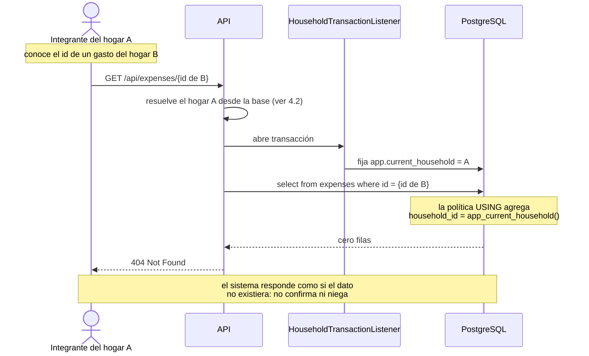
```mermaid
sequenceDiagram
    actor A as Integrante del hogar A
    participant API as API
    participant L as HouseholdTransactionListener
    participant DB as PostgreSQL

    Note over A: conoce el id de un gasto del hogar B
    A->>API: GET /api/expenses/{id de B}
    API->>API: resuelve el hogar A desde la base (ver 4.2)
    API->>L: abre transacción
    L->>DB: fija app.current_household = A
    API->>DB: select from expenses where id = {id de B}

    Note over DB: la política USING agrega<br/>household_id = app_current_household()
    DB-->>API: cero filas
    API-->>A: 404 Not Found

    Note over A,DB: el sistema responde como si el dato<br/>no existiera: no confirma ni niega
```

Si el contexto no se hubiera fijado, `app_current_household()` devolvería nulo y el resultado sería
el mismo, cero filas. El sistema falla cerrado.

---

## 5. Diagramas de actividad

Los rombos son decisiones, el círculo simple es el inicio y el doble, el fin.

### 5.1 Inicio de sesión (CU-02)

Los intentos fallidos se cuentan por correo ingresado y no por cuenta, así que un correo sin cuenta
también se bloquea. Ninguna respuesta permite deducir qué correos están registrados.

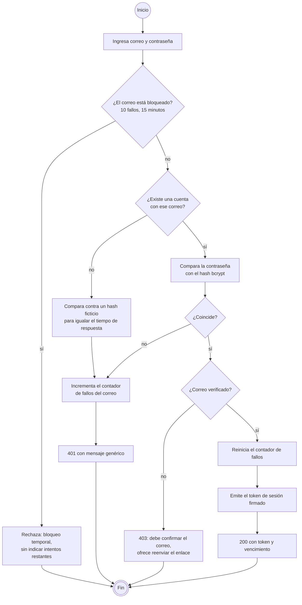
```mermaid
flowchart TD
    INI(("Inicio")) --> A1["Ingresa correo y contraseña"]
    A1 --> D1{"¿El correo está bloqueado?<br/>10 fallos, 15 minutos"}
    D1 -->|sí| R429["Rechaza: bloqueo temporal,<br/>sin indicar intentos restantes"]
    D1 -->|no| D2{"¿Existe una cuenta<br/>con ese correo?"}
    D2 -->|sí| H1["Compara la contraseña<br/>con el hash bcrypt"]
    D2 -->|no| H2["Compara contra un hash ficticio<br/>para igualar el tiempo de respuesta"]
    H1 --> D3{"¿Coincide?"}
    H2 --> F1
    D3 -->|no| F1["Incrementa el contador<br/>de fallos del correo"]
    F1 --> R401["401 con mensaje genérico"]
    D3 -->|sí| D4{"¿Correo verificado?"}
    D4 -->|no| R403["403: debe confirmar el correo,<br/>ofrece reenviar el enlace"]
    D4 -->|sí| OK1["Reinicia el contador de fallos"]
    OK1 --> OK2["Emite el token de sesión firmado"]
    OK2 --> R200["200 con token y vencimiento"]

    R429 --> FIN((("Fin")))
    R401 --> FIN
    R403 --> FIN
    R200 --> FIN
```

### 5.2 Registro de un gasto y resolución de la categoría (CU-04)

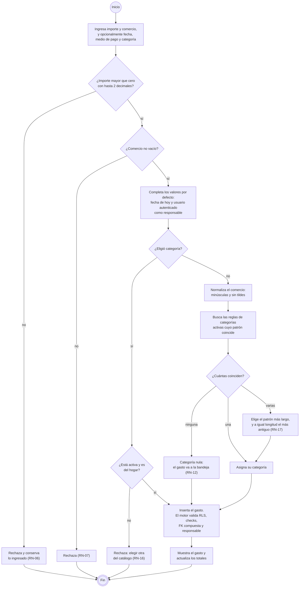
```mermaid
flowchart TD
    INI(("Inicio")) --> A1["Ingresa importe y comercio,<br/>y opcionalmente fecha, medio de pago y categoría"]
    A1 --> D1{"¿Importe mayor que cero<br/>con hasta 2 decimales?"}
    D1 -->|no| R1["Rechaza y conserva<br/>lo ingresado (RN-06)"]
    D1 -->|sí| D2{"¿Comercio no vacío?"}
    D2 -->|no| R2["Rechaza (RN-07)"]
    D2 -->|sí| A2["Completa los valores por defecto:<br/>fecha de hoy y usuario autenticado<br/>como responsable"]
    A2 --> D3{"¿Eligió categoría?"}

    D3 -->|sí| D4{"¿Está activa y es<br/>del hogar?"}
    D4 -->|no| R3["Rechaza: elegir otra<br/>del catálogo (RN-16)"]
    D4 -->|sí| INS

    D3 -->|no| M1["Normaliza el comercio:<br/>minúsculas y sin tildes"]
    M1 --> M2["Busca las reglas de categorías<br/>activas cuyo patrón coincide"]
    M2 --> D5{"¿Cuántas coinciden?"}
    D5 -->|ninguna| M3["Categoría nula:<br/>el gasto va a la bandeja (RN-12)"]
    D5 -->|una| M4["Asigna su categoría"]
    D5 -->|varias| M5["Elige el patrón más largo,<br/>y a igual longitud el más antiguo (RN-17)"]
    M5 --> M4
    M3 --> INS
    M4 --> INS

    INS["Inserta el gasto.<br/>El motor valida RLS, checks,<br/>FK compuesta y responsable"]
    INS --> OK["Muestra el gasto y<br/>actualiza los totales"]

    R1 --> FIN((("Fin")))
    R2 --> FIN
    R3 --> FIN
    OK --> FIN
```

### 5.3 Crear una regla y reclasificar retroactivamente (CU-05)

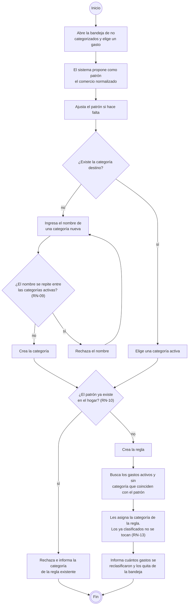
```mermaid
flowchart TD
    INI(("Inicio")) --> A1["Abre la bandeja de no<br/>categorizados y elige un gasto"]
    A1 --> A2["El sistema propone como patrón<br/>el comercio normalizado"]
    A2 --> A3["Ajusta el patrón si hace falta"]
    A3 --> D1{"¿Existe la categoría destino?"}
    D1 -->|sí| A4["Elige una categoría activa"]
    D1 -->|no| C1["Ingresa el nombre de<br/>una categoría nueva"]
    C1 --> D2{"¿El nombre se repite entre<br/>las categorías activas? (RN-09)"}
    D2 -->|sí| C2["Rechaza el nombre"]
    C2 --> C1
    D2 -->|no| C3["Crea la categoría"]
    C3 --> D3
    A4 --> D3{"¿El patrón ya existe<br/>en el hogar? (RN-10)"}
    D3 -->|sí| R1["Rechaza e informa la categoría<br/>de la regla existente"]
    D3 -->|no| B1["Crea la regla"]
    B1 --> B2["Busca los gastos activos y sin<br/>categoría que coinciden con el patrón"]
    B2 --> B3["Les asigna la categoría de la regla.<br/>Los ya clasificados no se tocan (RN-13)"]
    B3 --> B4["Informa cuántos gastos se<br/>reclasificaron y los quita de la bandeja"]

    R1 --> FIN((("Fin")))
    B4 --> FIN
```

### 5.4 Restablecer la contraseña (CU-08)

La respuesta a la solicitud es idéntica exista o no la cuenta, para no permitir enumerar correos.

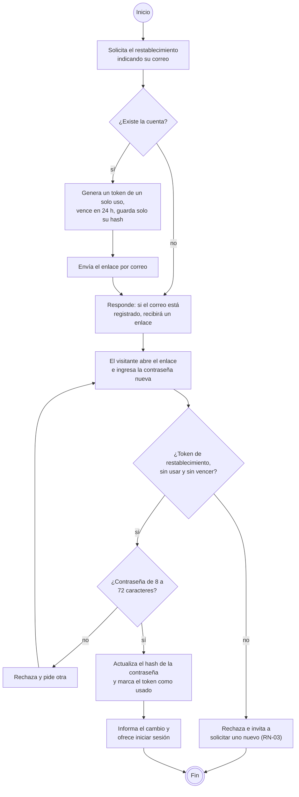
```mermaid
flowchart TD
    INI(("Inicio")) --> A1["Solicita el restablecimiento<br/>indicando su correo"]
    A1 --> D1{"¿Existe la cuenta?"}
    D1 -->|no| A3
    D1 -->|sí| A2["Genera un token de un solo uso,<br/>vence en 24 h, guarda solo su hash"]
    A2 --> A2b["Envía el enlace por correo"]
    A2b --> A3["Responde: si el correo está<br/>registrado, recibirá un enlace"]
    A3 --> W1["El visitante abre el enlace<br/>e ingresa la contraseña nueva"]
    W1 --> D2{"¿Token de restablecimiento,<br/>sin usar y sin vencer?"}
    D2 -->|no| R1["Rechaza e invita a<br/>solicitar uno nuevo (RN-03)"]
    D2 -->|sí| D3{"¿Contraseña de 8 a<br/>72 caracteres?"}
    D3 -->|no| R2["Rechaza y pide otra"]
    R2 --> W1
    D3 -->|sí| B1["Actualiza el hash de la contraseña<br/>y marca el token como usado"]
    B1 --> B2["Informa el cambio y<br/>ofrece iniciar sesión"]

    R1 --> FIN((("Fin")))
    B2 --> FIN
```

---

## 6. Diagrama de despliegue

Mermaid no tiene un tipo de diagrama de despliegue. Los nodos se representan como contenedores con
el estereotipo de UML entre comillas angulares, y las flechas son rutas de comunicación desde quien
inicia la conexión.

### 6.1 Producción

Despliegue previsto en la propuesta (§6). Los tres componentes quedan en línea y se publican
automáticamente desde la rama principal.

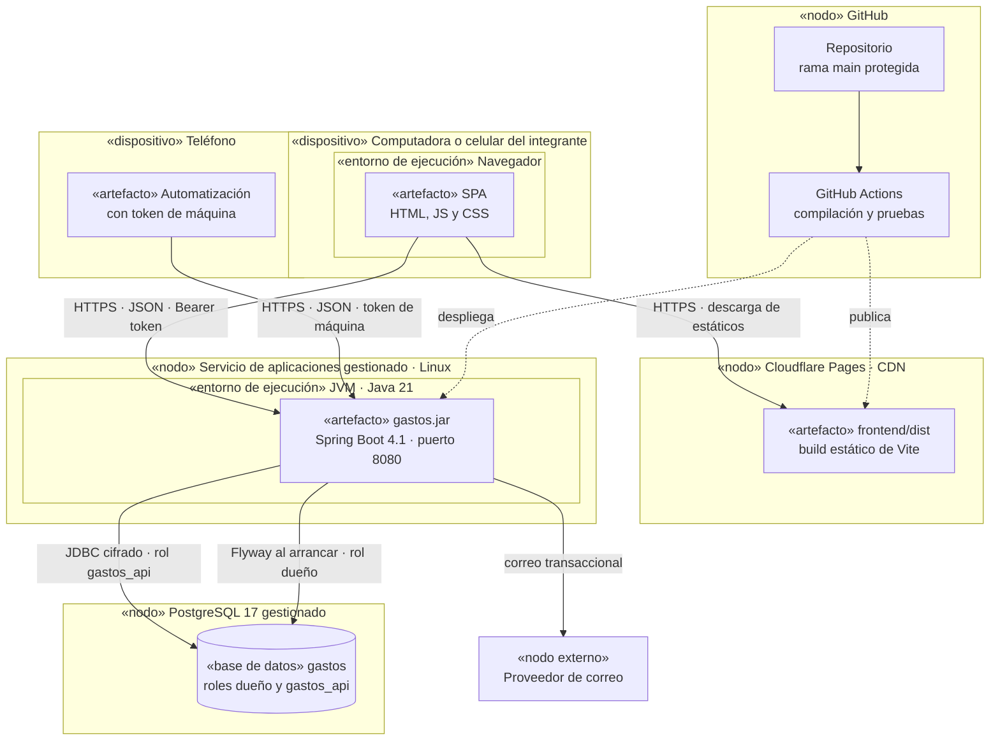
```mermaid
flowchart TB
    subgraph USR["«dispositivo» Computadora o celular del integrante"]
        subgraph BRW["«entorno de ejecución» Navegador"]
            SPA["«artefacto» SPA<br/>HTML, JS y CSS"]
        end
    end

    subgraph PHN["«dispositivo» Teléfono"]
        AUT["«artefacto» Automatización<br/>con token de máquina"]
    end

    subgraph CF["«nodo» Cloudflare Pages · CDN"]
        DIST["«artefacto» frontend/dist<br/>build estático de Vite"]
    end

    subgraph APP["«nodo» Servicio de aplicaciones gestionado · Linux"]
        subgraph JVM["«entorno de ejecución» JVM · Java 21"]
            JAR["«artefacto» gastos.jar<br/>Spring Boot 4.1 · puerto 8080"]
        end
    end

    subgraph PGS["«nodo» PostgreSQL 17 gestionado"]
        DBS[("«base de datos» gastos<br/>roles dueño y gastos_api")]
    end

    MAILX["«nodo externo»<br/>Proveedor de correo"]

    subgraph GH["«nodo» GitHub"]
        REPO["Repositorio<br/>rama main protegida"]
        GHA["GitHub Actions<br/>compilación y pruebas"]
        REPO --> GHA
    end

    SPA -->|"HTTPS · descarga de estáticos"| DIST
    SPA -->|"HTTPS · JSON · Bearer token"| JAR
    AUT -->|"HTTPS · JSON · token de máquina"| JAR
    JAR -->|"JDBC cifrado · rol gastos_api"| DBS
    JAR -->|"Flyway al arrancar · rol dueño"| DBS
    JAR -->|"correo transaccional"| MAILX
    GHA -.->|"publica"| DIST
    GHA -.->|"despliega"| JAR
```

| Nodo | Artefacto | Configuración |
|---|---|---|
| Cloudflare Pages | Build estático de `frontend/` (`npm run build`) | `VITE_API_URL`, fijada en el momento del build. Un build de producción sin ella falla al cargar. |
| Servicio de aplicaciones | Jar ejecutable de `backend/` (`./mvnw package`) | `DB_URL`, `DB_API_USERNAME`, `DB_API_PASSWORD`, `DB_ADMIN_USERNAME`, `DB_ADMIN_PASSWORD`, `EMAIL_SENDER`. La rama de autenticación suma `JWT_SECRET` y `CORS_ALLOWED_ORIGINS`. |
| PostgreSQL gestionado | Esquema creado por las migraciones V1 a V5 | Copias de seguridad automáticas del proveedor (RNF-20) y conexión cifrada. |

Ningún secreto se versiona. Todos se inyectan como variables de entorno del servicio (RNF-07). Si
falta `EMAIL_SENDER`, la API no arranca, para que un despliegue no quede escribiendo tokens en el
log. La plataforma verifica el estado con `GET /actuator/health`, que responde sin autenticación y
sin detalle de componentes (RF-41).

**Las dos conexiones a la base.** Flyway migra con el rol dueño del esquema y la aplicación
consulta con `gastos_api`, que no puede omitir las políticas. Son credenciales distintas a
propósito. Si la aplicación usara el rol dueño, el aislamiento dependería solo del código (RNF-04).

### 6.2 Desarrollo local y pruebas

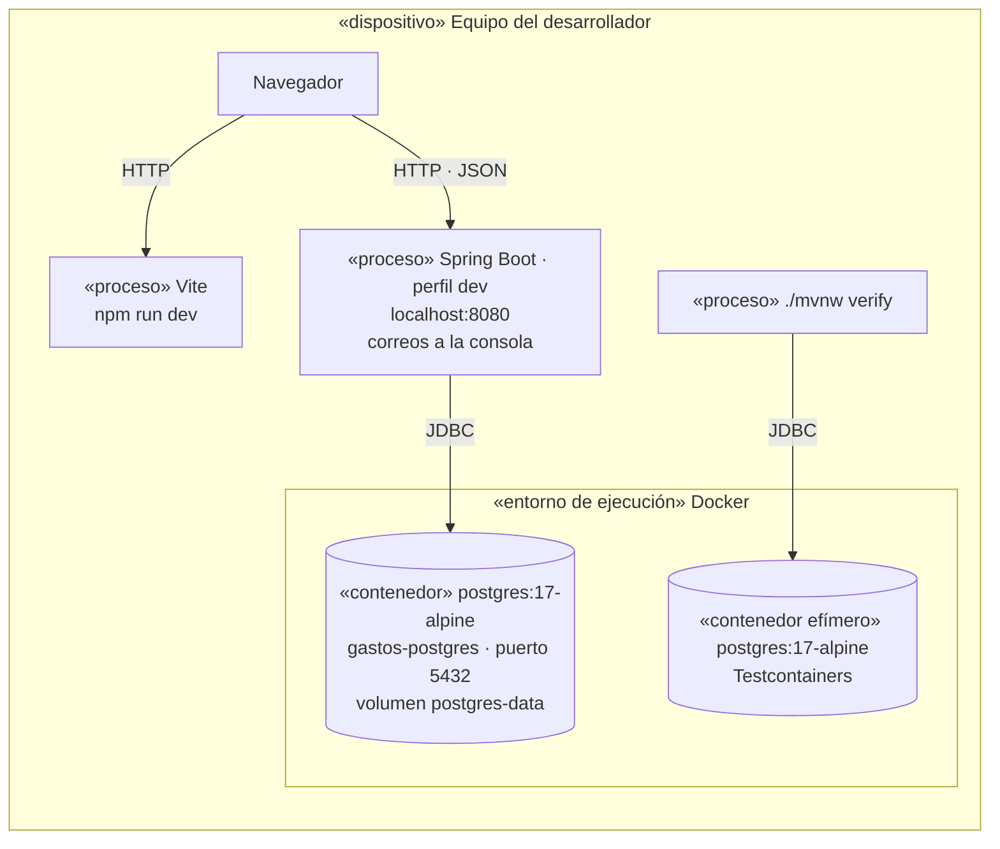
```mermaid
flowchart LR
    subgraph PC["«dispositivo» Equipo del desarrollador"]
        BRW["Navegador"]
        VITE["«proceso» Vite<br/>npm run dev"]
        BOOT["«proceso» Spring Boot · perfil dev<br/>localhost:8080<br/>correos a la consola"]
        MVN["«proceso» ./mvnw verify"]

        subgraph DCK["«entorno de ejecución» Docker"]
            PGC[("«contenedor» postgres:17-alpine<br/>gastos-postgres · puerto 5432<br/>volumen postgres-data")]
            TC[("«contenedor efímero» postgres:17-alpine<br/>Testcontainers")]
        end
    end

    BRW -->|"HTTP"| VITE
    BRW -->|"HTTP · JSON"| BOOT
    BOOT -->|"JDBC"| PGC
    MVN -->|"JDBC"| TC
```

`docker compose up -d` levanta la base de desarrollo (RNF-27). Las pruebas de integración no la
usan: levantan su propio PostgreSQL 17 con Testcontainers, la misma versión mayor que producción
(RNF-28), y lo descartan al terminar.

---

## 7. Diagramas complementarios

### 7.1 Estados de un gasto

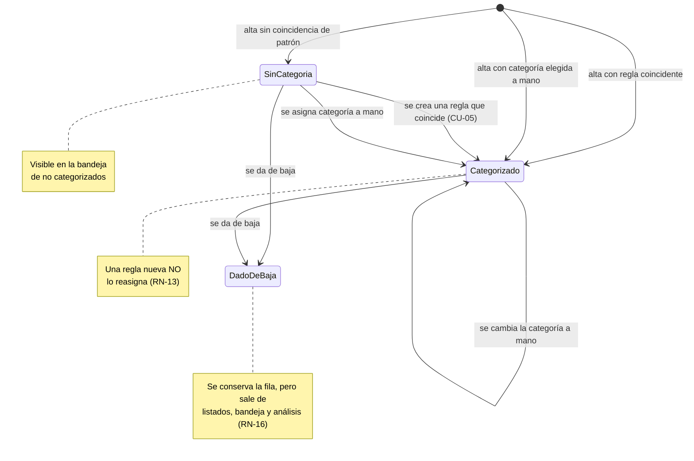
```mermaid
stateDiagram-v2
    [*] --> SinCategoria: alta sin coincidencia de patrón
    [*] --> Categorizado: alta con regla coincidente
    [*] --> Categorizado: alta con categoría elegida a mano

    SinCategoria --> Categorizado: se crea una regla que coincide (CU-05)
    SinCategoria --> Categorizado: se asigna categoría a mano
    Categorizado --> Categorizado: se cambia la categoría a mano

    SinCategoria --> DadoDeBaja: se da de baja
    Categorizado --> DadoDeBaja: se da de baja

    note right of SinCategoria
        Visible en la bandeja
        de no categorizados
    end note

    note right of Categorizado
        Una regla nueva NO
        lo reasigna (RN-13)
    end note

    note right of DadoDeBaja
        Se conserva la fila, pero sale de
        listados, bandeja y análisis (RN-16)
    end note
```

### 7.2 Modelo entidad-relación (vista resumida)

Vista de relaciones y cardinalidades, con las columnas principales. El diagrama completo, con todas
las columnas y restricciones, está en [der/DER-gastos.svg](der/DER-gastos.svg); la descripción en
prosa, en [modelo-de-datos.md](modelo-de-datos.md).

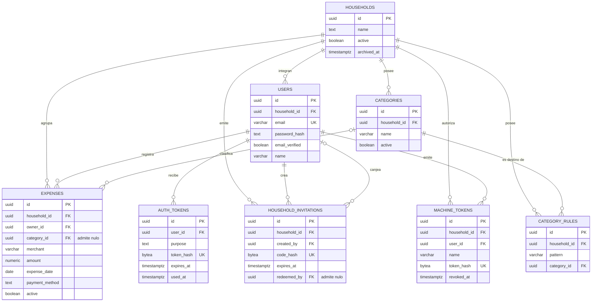
```mermaid
erDiagram
    HOUSEHOLDS ||--o{ USERS : "integran"
    HOUSEHOLDS ||--o{ CATEGORIES : "posee"
    HOUSEHOLDS ||--o{ CATEGORY_RULES : "posee"
    HOUSEHOLDS ||--o{ EXPENSES : "agrupa"
    USERS ||--o{ EXPENSES : "registra"
    CATEGORIES ||--o{ CATEGORY_RULES : "es destino de"
    CATEGORIES |o--o{ EXPENSES : "clasifica"
    USERS ||--o{ AUTH_TOKENS : "recibe"
    HOUSEHOLDS ||--o{ HOUSEHOLD_INVITATIONS : "emite"
    USERS ||--o{ HOUSEHOLD_INVITATIONS : "crea"
    USERS |o--o{ HOUSEHOLD_INVITATIONS : "canjea"
    HOUSEHOLDS ||--o{ MACHINE_TOKENS : "autoriza"
    USERS ||--o{ MACHINE_TOKENS : "emite"

    HOUSEHOLDS {
        uuid id PK
        text name
        boolean active
        timestamptz archived_at
    }
    USERS {
        uuid id PK
        uuid household_id FK
        varchar email UK
        text password_hash
        boolean email_verified
        varchar name
    }
    CATEGORIES {
        uuid id PK
        uuid household_id FK
        varchar name
        boolean active
    }
    CATEGORY_RULES {
        uuid id PK
        uuid household_id FK
        varchar pattern
        uuid category_id FK
    }
    EXPENSES {
        uuid id PK
        uuid household_id FK
        uuid owner_id FK
        uuid category_id FK "admite nulo"
        varchar merchant
        numeric amount
        date expense_date
        text payment_method
        boolean active
    }
    AUTH_TOKENS {
        uuid id PK
        uuid user_id FK
        text purpose
        bytea token_hash UK
        timestamptz expires_at
        timestamptz used_at
    }
    HOUSEHOLD_INVITATIONS {
        uuid id PK
        uuid household_id FK
        uuid created_by FK
        bytea code_hash UK
        timestamptz expires_at
        uuid redeemed_by FK "admite nulo"
    }
    MACHINE_TOKENS {
        uuid id PK
        uuid household_id FK
        uuid user_id FK
        varchar name
        bytea token_hash UK
        timestamptz revoked_at
    }
```

**Sobre la cardinalidad de `CATEGORIES` a `EXPENSES`.** Es `|o--o{`: un gasto tiene *cero o una*
categoría. El cero es la bandeja de no categorizados, y es una decisión de diseño explícita
(RN-12), no una laxitud del modelo.

**Las tablas de acceso no tienen RLS.** `auth_tokens`, `household_invitations` y `machine_tokens`,
igual que `users`, se consultan justamente sin contexto de hogar: al verificar un correo, al canjear
un código o al autenticar una automatización. Guardan solo el hash SHA-256 del valor en claro.

